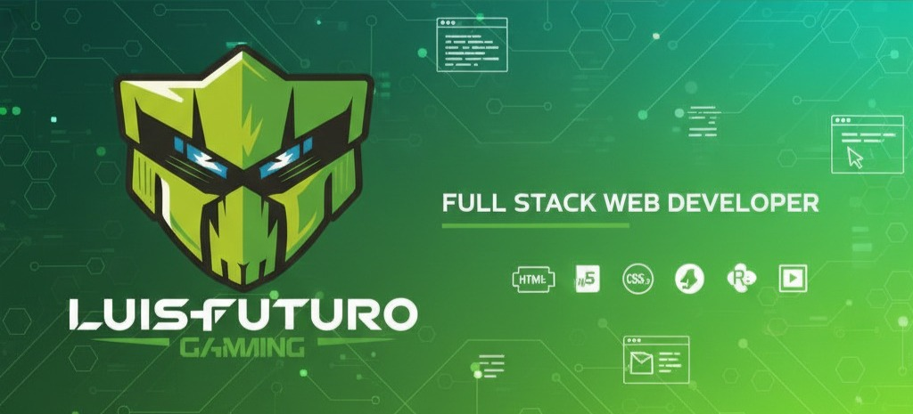

<!-- Imagen principal con tu background -->

  

---

## 🚀 About Me  

- 🌎 From **La Paz, Bolivia**  
- 💻 Passionate **Fullstack Web Developer (Junior)**  
- 🌱 Constantly learning and building **real-world projects**  
- 🎯 Goal: grow into a **tech entrepreneur** and lead impactful digital solutions  

---

## ⚡ Animated Vibes  

  <!-- Rayos verdes animados con SVG -->
  

  

---

## 🛠️ Tech Stack  

  

  
  
  
  
  
  
  
  
  
  

---

## 🌐 Connect with Me  

  
  
  
  

---

## ✨ Fun Fact  

  

> *“The future belongs to those who code it.”* 🚀  

---

<!-- Footer verde eléctrico -->

  

